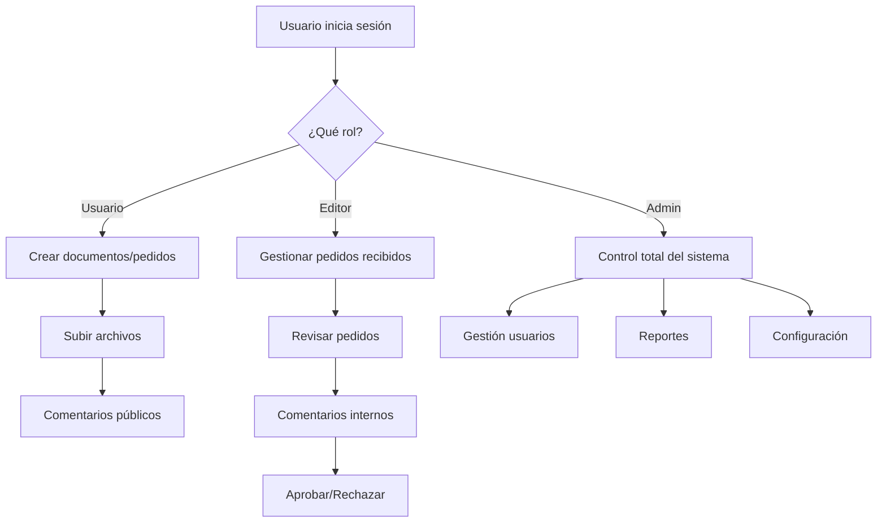

# 📋 Sistema de Gestión de Documentos y Pedidos

<div align="center">


**🚀 Sistema completo de gestión de documentos y pedidos con roles de usuario avanzados**

[](LICENSE)
[](CHANGELOG.md)
[]()

</div>

---

## 🎯 **Características Principales**

### 👥 **Sistema de Roles Avanzado**
- **👑 Administrador**: Control total del sistema
- **👤 Usuario Normal**: Gestión de documentos y pedidos
- **📦 Editor/Almacén**: Gestión de pedidos recibidos y comentarios internos
- **🔒 Dueño**: Acceso administrativo completo

### 📄 **Gestión de Documentos**
- ✅ Subida de documentos (PDF, Word, Excel)
- ✅ Sistema de comentarios por documento
- ✅ Control de acceso por usuario
- ✅ Eliminación segura de documentos

### 📋 **Sistema de Pedidos**
- ✅ Creación de solicitudes con archivos adjuntos
- ✅ Estados: Pendiente, Aprobado, Rechazado, En Revisión, Cerrado
- ✅ Sistema de comentarios públicos e internos
- ✅ Notificaciones automáticas
- ✅ Descarga de archivos adjuntos

### 🔒 **Comentarios Internos**
- ✅ Comentarios visibles solo para almacén/administradores
- ✅ Comunicación interna segura
- ✅ Notificaciones diferenciadas por tipo

### 📊 **Reportes Exportables**
- ✅ Generación de reportes en Excel
- ✅ Filtros por estado, fecha, solicitante
- ✅ Exportación directa desde el navegador

---

## 🏗️ **Arquitectura del Proyecto**

```
📁 documentos_app2/
├── 📁 admin/                    # Herramientas de administración
│   ├── configurar_editor.php    # Configuración de roles
│   ├── limpiar_solicitudes.php  # Limpieza de datos
│   └── notificaciones.php       # Gestión de notificaciones
├── 📁 assets/                   # Recursos estáticos
│   ├── 📁 css/                  # Estilos CSS
│   ├── 📁 img/                  # Imágenes
│   └── 📁 js/                   # JavaScript
├── 📁 config/                   # Configuración del sistema
│   ├── auth.php                 # Autenticación
│   └── conexion.php             # Conexión a base de datos
├── 📁 modules/                  # Módulos principales
│   ├── 📁 documentos/           # Gestión de documentos
│   ├── 📁 pedidos/              # Sistema de pedidos
│   ├── 📁 reportes/             # Generación de reportes
│   └── 📁 usuarios/             # Gestión de usuarios
├── 📁 uploads/                  # Archivos subidos
│   └── 📁 pedidos/              # Archivos de pedidos
├── 📁 temp/                     # Archivos temporales/debug
├── 📁 BASE DE DATOS/            # Scripts SQL
├── index.php                    # Punto de entrada
├── dashboard.php                # Panel principal
└── logout.php                   # Cerrar sesión
```

---

## 🚀 **Instalación Rápida**

### **Requisitos**
- PHP 7.4+ 
- MySQL 5.7+ / MariaDB 10.3+
- Servidor web (Apache/Nginx)
- XAMPP/WAMP/LAMP (recomendado)

### **Pasos de Instalación**

1. **📥 Clonar el repositorio**
   ```bash
   git clone https://github.com/tu-usuario/Online-Documents-local.git
   cd Online-Documents-local
   ```

2. **🗄️ Configurar Base de Datos**
   ```sql
   -- Importar el archivo de base de datos
   mysql -u root -p < BASE_DE_DATOS/documents.sql
   ```

3. **⚙️ Configurar Conexión**
   ```php
   // Editar config/conexion.php
   $host = 'localhost';
   $dbname = 'documents';
   $username = 'tu_usuario';
   $password = 'tu_password';
   ```

4. **🔧 Configurar Rol Editor**
   ```sql
   -- Ejecutar en phpMyAdmin o MySQL
   ALTER TABLE `usuarios` MODIFY `rol` ENUM('usuario','dueno','admin','almacen','Editor') DEFAULT 'usuario';
   ```

5. **🌐 Configurar Servidor Web**
   - Apuntar el DocumentRoot a la carpeta del proyecto
   - Asegurar permisos de escritura en `uploads/`

---

## 👤 **Usuarios por Defecto**

| Usuario | Contraseña | Rol | Descripción |
|---------|------------|-----|-------------|
| `admin` | `admin123` | admin | Administrador principal |
| `almacen` | `password` | Editor | Usuario de almacén |
| `usuario` | `123456` | usuario | Usuario normal |

---

## 🔧 **Configuración Avanzada**

### **Roles de Usuario**
```php
// Roles disponibles
'usuario'    // Usuario normal - puede crear documentos y pedidos
'admin'      // Administrador - acceso total
'dueno'      // Dueño - acceso administrativo
'almacen'    // Almacén - gestión de pedidos (deprecated)
'Editor'     // Editor - gestión de pedidos recibidos
```

### **Tipos de Archivo Permitidos**
- **Documentos**: PDF, DOC, DOCX, XLS, XLSX
- **Pedidos**: PDF, DOC, DOCX, XLS, XLSX (múltiples archivos → ZIP)

### **Estados de Pedidos**
- `pendiente` - Recién creado
- `en_revision` - En proceso de revisión
- `aprobada` - Aprobado por almacén
- `rechazada` - Rechazado
- `cerrada` - Proceso completado

---

## 📱 **Capturas de Pantalla**

<div align="center">

### 🏠 Dashboard Principal


### 📋 Gestión de Pedidos


### 📄 Gestión de Documentos


### 👥 Gestión de Usuarios


</div>

---

## 🛠️ **Funcionalidades Técnicas**

### **Seguridad**
- ✅ Autenticación por sesiones PHP
- ✅ Control de acceso basado en roles (RBAC)
- ✅ Validación de archivos (tipo, tamaño)
- ✅ Sanitización de entradas
- ✅ Protección contra inyección SQL

### **Base de Datos**
- ✅ Diseño normalizado
- ✅ Índices optimizados
- ✅ Transacciones para operaciones críticas
- ✅ Constraints de integridad

### **Interfaz de Usuario**
- ✅ Diseño responsivo con Bootstrap 5.3
- ✅ Iconos Bootstrap Icons
- ✅ Animaciones CSS suaves
- ✅ Feedback visual inmediato
- ✅ Modales para confirmaciones

---

## 🔄 **Flujo de Trabajo**



---

## 📊 **Estadísticas del Proyecto**

- **📁 Archivos**: 50+ archivos PHP organizados
- **🗄️ Tablas**: 6 tablas principales
- **👥 Roles**: 5 roles de usuario
- **📄 Módulos**: 4 módulos principales
- **🔧 Funcionalidades**: 20+ características

---

## 🤝 **Contribución**

¿Quieres contribuir al proyecto? ¡Excelente!

1. **🍴 Fork** el repositorio
2. **🌿 Crea** una rama para tu feature (`git checkout -b feature/nueva-funcionalidad`)
3. **💾 Commit** tus cambios (`git commit -am 'Agregar nueva funcionalidad'`)
4. **📤 Push** a la rama (`git push origin feature/nueva-funcionalidad`)
5. **🔄 Abre** un Pull Request

---

## 📞 **Soporte**

¿Necesitas ayuda? 

- 📧 **Email**: soporte@tudominio.com
- 🐛 **Issues**: [GitHub Issues](https://github.com/tu-usuario/Online-Documents-local/issues)
- 📖 **Wiki**: [Documentación completa](https://github.com/tu-usuario/Online-Documents-local/wiki)

---

## 📄 **Licencia**

Este proyecto está bajo la Licencia MIT. Ver el archivo [LICENSE](LICENSE) para más detalles.

---

## 🙏 **Agradecimientos**

- **Bootstrap** por el framework CSS
- **Bootstrap Icons** por los iconos
- **PHP** por el lenguaje de programación
- **MySQL** por la base de datos

---

<div align="center">

**⭐ Si te gusta este proyecto, ¡dale una estrella! ⭐**


---

**Desarrollado con ❤️ por [ElMOB04](https://github.com/ElMOB04)**

</div>


